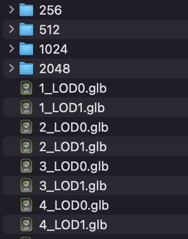

# glTF Optimizer

<!-- <p align="center">
<a href="https://www.khronos.org/gltf"></a>
</p> -->

`gltf-optimizer` is a tool that optimizes models and textures by combining several command-line tools.

## Getting Started

Install [Python3](https://www.python.org/) 

Install [Node.js](https://nodejs.org/en/) if you don't already have it, and then:

```
npm install -g imagemagick
npm install -g gltf-pipeline
npm install -g @gltf-transform/cli
```

Install [toKTX](https://github.com/KhronosGroup/KTX-Software/blob/main/BUILDING.md) toKTX can be built through cmake, or in the case of mac os, the toKtx Unix executable file in this path can be used by putting it in the path (/usr/local/bin) to which the environment variable is added.

#### Ref

- imagemagick : used for texture resize. (https://imagemagick.org/Usage/resize/)
- toktx : used to convert the format of texture to ktx2 (https://github.khronos.org/KTX-Software/ktxtools/toktx.html)
- gltf-pipeline : used for converting glTF to glb and extracting separate textures(https://github.com/CesiumGS/gltf-pipeline)
- @gltf-transform/cli : used for optimizing the mesh (https://gltf-transform.donmccurdy.com/cli)

#### Optimize a glTF or glb

`gltf-optimizer --path <input gltf path> --output <output gltf path> --config <config json path>`

`gltf-optimizer --path ./source --output ./public/assets/ --config ./tools/config.json`

## Output
</image>
## Using Babylonjs

```ts
SceneLoader.OnPluginActivatedObservable.add((loader) => {
  const gltfLoader = loader as unknown as GLTFFileLoader;
  gltfLoader.onParsed = (data) => {
    // @ts-ignore
    const images: IImage[] = data.json['images'];
    for (const image of images) {
      if (image.uri) {
        // textureMaxSize : 256, 512 ...
        image.uri = `${textureMaxSize}/${image.uri}`;
      }
    }
  };
});
```
In this way, when loading a gltf/glb file, you can receive data through the onParsed event and change the uri to textureMaxSize at runtime.

```ts
const src = `/assets/model${suffix}.glb`
await SceneLoader.ImportMeshAsync(
  '',
  src
);
```
It is useful to change the model like this and call it.

## Config.json 

```JSON

{
  "output_ext" : [".glb", ".gltf"],
  "texture_settings" : [
    {
      "max_size" : 512,
      "scale" : 1,

      "defualt_format" : "etc1s",
      "keywords" : ["final"],
    },
    {
      "max_size" : 2048,
      "scale" : 1,

      "defualt_format" : "etc1s",
      "keywords" : ["final"],

      "uastc_blk_d" : "8x8",
      "uastc_quality" : 2,
      "uastc_rdo_l": 0.5,
      "uastc_rdo_d": 8192,
      "zcmp": 22,

      "clevel": 1,
      "qlevel" : 128,

      "assign_oetf": "srgb"
    }
  ],
  "model_settings" : [
    {
      "suffix" : "_LOD0",
    },
    {
      "suffix" : "_LOD1",
      "lock_border" : false,

      "tolerance" : 0.0001,
      "ratio" : 0.5,
      "error" : 0.01,

      "decode_speed" : 7, 
      "encode_speed": 7, 
      "quantize_position": 11, 
      "quantize_normal" : 8,
      "quantize_texcoord": 10,  
      "quantize_color": 8
    }
  ]
}


```

```JSON
"output_ext" : [".glb", ".gltf"]
```
- output_ext : finally, set the extension to be extracted to the output path. ".glb", ".gltf" can be set.

```JSON
"texture_settings" : [
    {
      "max_size" : 512,
      "scale" : 1,

      "defualt_format" : "etc1s",
      "keywords" : ["final"],
    },
    {
      "max_size" : 2048,
      "scale" : 1,

      "defualt_format" : "etc1s",
      "keywords" : ["final"],
      
      "uastc_blk_d" : "8x8",
      "uastc_quality" : 2,
      "uastc_rdo_l": 0.5,
      "uastc_rdo_d": 8192,
      "zcmp": 22,

      "clevel": 1,
      "qlevel" : 128,

      "assign_oetf": "srgb"
    }
  ]
```
#### These are settings related to texture optimization.
- [Required] max_size : <256|512|1024|2048|4096> sets the maximum size of the texture. Resize the size of the texture according to the ratio so that it does not exceed this value.
- [Option] scale : reduce the size of the image by this value. range is [0.01, 1.00]. default value is 1.
- [Option] defualt_format : <uastc|etc1s> sets the default format to be compressed as ktx2. default value is "etc1s".
- [Option] keywords : textures with this keyword in their name will be compressed in the opposite format to defualt_format. If defualt_format is "etc1s", textures with this keyword are compressed with uastc ktx2.

#### refer to (https://github.khronos.org/KTX-Software/ktxtools/toktx.html) for the values ​​below.

- [Option/uastc] uastc_blk_d : specify which block dimension to use for compressing the textures. default value is 8x8.
- [Option/uastc] uastc_quality : This optional parameter selects a speed vs quality tradeoff. default value is 2.
- [Option/uastc] uastc_rdo_l : Lower values yield higher quality/larger LZ compressed files, higher values yield lower quality/smaller LZ compressed files. A good range to try is [.25,10]. For normal maps a good range is [.25,.75]. The full range is [.001,10.0]. default value is 0.5.
- [Option/uastc] uastc_rdo_d : lower values=faster, but give less compression. default value is 8192.
- [Option/uastc] zcmp : lower values=faster but give less compression. Values above 20 should be used with caution as they require more memory. default value is 22.

- [Option/etc1] clevel : ETC1S / BasisLZ compression level, an encoding speed vs. quality tradeoff. Range is [0,5], Higher values are slower but give higher quality.
default value is 1. 
- [Option/etc1] qlevel : ETC1S / BasisLZ quality level. Range is [1,255]. Lower gives better compression/lower quality/faster. Higher gives less compression/higher quality/slower. --qlevel automatically determines values for --max_endpoints, --max-selectors, --endpoint_rdo_threshold and --selector_rdo_threshold for the target quality level. Setting these options overrides the values determined by -qlevel which defaults to 128 if neither it nor both of --max_endpoints and --max_selectors have been set.

- [Option/common] assign_oetf : <linear|srgb> force the created texture to have the specified transfer function. default valus is srgb.

```JSON
"model_settings" : [
    {
      "suffix" : "_LOD0",
    },
    {
      "suffix" : "_LOD1",
      
      "tolerance" : 0.0001,
      "ratio" : 0.5,
      "error" : 0.01,
      "lock_border" : false,

      "decode_speed" : 7, 
      "encode_speed": 7, 
      "quantize_position": 11, 
      "quantize_normal" : 8,
      "quantize_texcoord": 10,  
      "quantize_color": 8
    }
  ]
```
#### These are settings related to mesh optimization.
- suffix : the suffix to append to the model to be extracted. For example, if suffix is ​​"_LOD0" in model.glb, it is extracted as model_LOD0.glb.

#### refer to (https://gltf-transform.donmccurdy.com/cli) for the values ​​below.

##### weld : Index Primitives and (optionally) merge similar vertices.
- [Option] tolerance : tolerance for vertex welding. default value is 0.0001. If this value is not entered, weld is omitted.

##### simplify
- [Option] ratio : target ratio (0–1) of vertices to keep. If this value is not provided, simplify will be skipped.
- [Option] error : limit on error, as a fraction of mesh r. default value is 0.01.
- [Option] lock_border : whether to lock topological borders of. default value is False

##### draco
- [Option] decode_speed : Decoding speed vs. compression level, 1–10.   
- [Option] encode_speed : Encoding speed vs. compression level, 1–10. 
- [Option] quantize_position : Quantization bits for POSITION, 1-16. default value is 11
- [Option] quantize_normal : Quantization bits for NORMAL, 1-16. default value is 8  
- [Option] quantize_texcoord : Quantization bits for TEXCOORD_*, 1-16. default value is 10
- [Option] quantize_color : Quantization bits for COLOR_*, 1-16. default value is 8

The default value was set by referring to gltf-pipeline(https://github.com/CesiumGS/gltf-pipeline).
